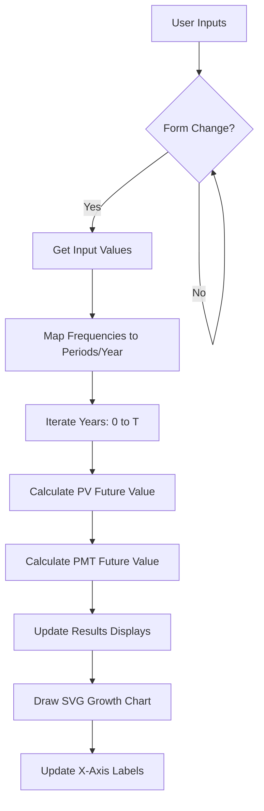

# Fukuri — Compound Interest Calculator

Fukuri (Japanese for "compound interest") is a clean, modern, and accessible investment projection tool. It allows users to calculate the long-term growth of their wealth, taking into account initial investments, regular contributions, and various compounding frequencies.

[](https://fukuri.yogu.one)
[](LICENSE)

## Purpose

The primary goal of Fukuri is to provide a simple yet powerful interface for financial planning. It helps users understand the exponential power of compound interest and the significant impact that even small, regular contributions can have over time.

## Key Features

- **Interactive Calculator**: Real-time updates as you adjust inputs.
- **Regular Contributions**: Support for weekly, monthly, and annual contributions.
- **Custom Compounding**: Choose from daily, weekly, monthly, quarterly, semi-annual, or annual compounding frequencies.
- **Visualisation**: A dynamic SVG-based growth chart that forecasts investment growth over time.
- **Dark Mode Support**: Automatically respects system preferences or allows manual toggling.
- **Mobile-First Design**: Fully responsive layout that works seamlessly across all device sizes.
- **Accessibility (A11y)**: Built with semantic HTML5 and follows WCAG standards for screen readers and keyboard navigation.
- **SEO Optimised**: Comprehensive meta tags, Open Graph support, and JSON-LD structured data for better search engine visibility.

## Technology Stack

Fukuri is built with a focus on simplicity and performance, using no external frameworks or heavy libraries:

- **HTML5**: Semantic markup for better accessibility and structure.
- **CSS3**: Modern CSS including Grid, Flexbox, and Custom Properties for theming.
- **Vanilla JavaScript (ES6+)**: Native DOM manipulation and calculation logic.
- **Deno**: Used for local development tools (server, formatting, and linting).

## Architecture & Calculation Flow

The following diagram illustrates the internal logic of the calculator:



## Requirements to Run

### For Users
No installation is required. You can simply open `web/index.html` in any modern web browser to use the calculator.

### For Developers
To contribute or run the project locally with full tooling support, you will need:
- [Deno](https://deno.land/) (v1.30.0 or higher recommended)
- `make` (optional, for shortcut commands)

## Local Development

1. **Start the local server**:
   ```bash
   make serve
   ```
   Alternatively: `deno run --allow-net --allow-read serve.ts`

2. **Format source files**:
   ```bash
   make fmt
   ```

3. **Lint source files**:
   ```bash
   make lint
   ```

The server will be available at `http://localhost:8000`.

## Project Structure

```text
fukuri/
├── web/
│   ├── index.html          # Main HTML document
│   ├── css/
│   │   ├── variables.css   # CSS Custom Properties (theming)
│   │   └── styles.css      # Core styles
│   ├── js/
│   │   ├── calculator.js   # Core calculation & SVG chart logic
│   │   └── theme.js        # Dark mode & preference management
│   └── assets/
│       └── fukuri.png      # Logo & favicon
├── AGENTS.md               # AI Agent & development guidelines
├── LICENSE                 # GNU GPL v3 Licence
├── Makefile                # Shortcut commands
├── README.md               # Project documentation
└── serve.ts                # Deno server script
```

## Calculation Formula

The calculator uses the standard compound interest formula with regular contributions:

$$A = P(1 + \frac{r}{n})^{nt} + PMT \times \frac{(1 + \frac{r}{n})^{nt} - 1}{\frac{r}{n}}$$

Where:
- **A**: Future value of the investment
- **P**: Principal investment amount (Start Value)
- **r**: Annual interest rate (decimal)
- **n**: Number of compounding periods per year
- **t**: Time in years (Forecast Period)
- **PMT**: Regular contribution amount

## Licence

This project is licensed under the **GNU General Public License v3 (GPL-3.0)**. See the [LICENSE](LICENSE) file for details.

## Contributing

Please refer to the [AGENTS.md](AGENTS.md) file for development standards and guidelines.
